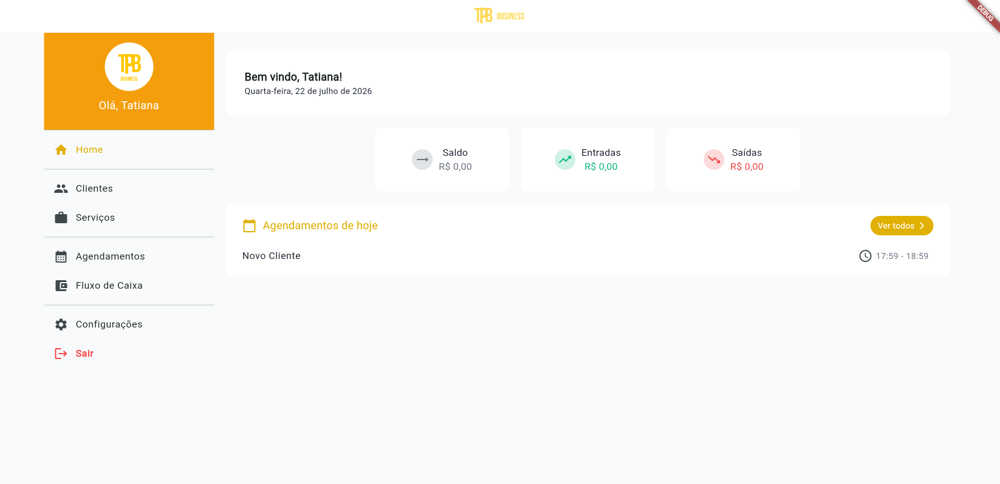
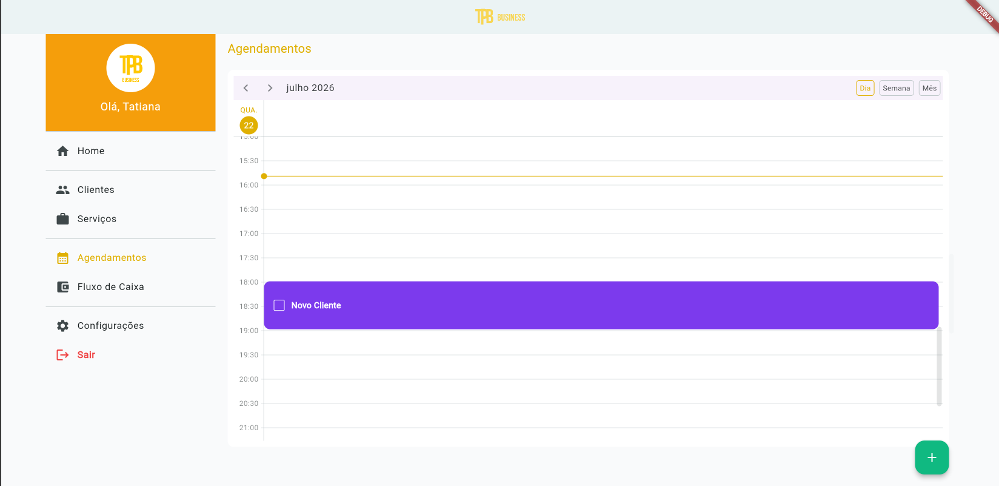
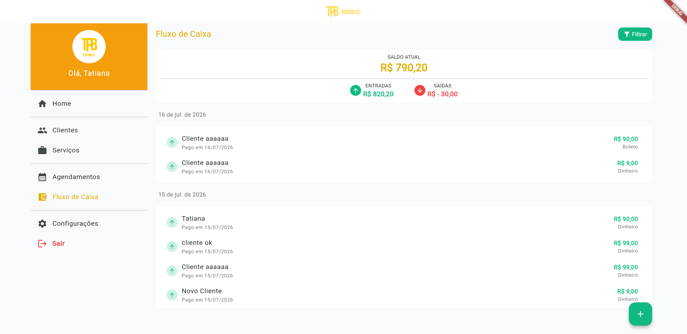
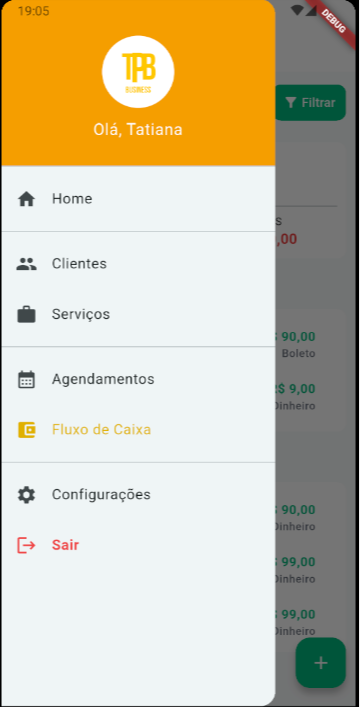
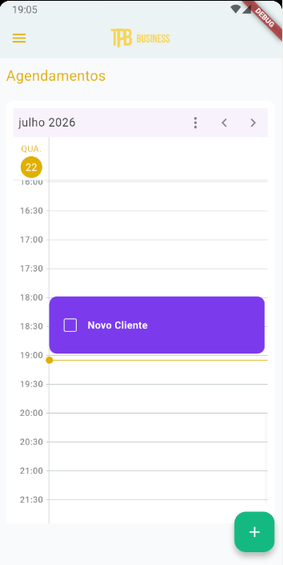

# TPB Business

## 📌 Sobre

**TPB Business** é um sistema completo para gestão financeira e agendamentos voltado para pequenos empreendedores (MEI), desenvolvido com Flutter e disponível na versão web e android.

A aplicação foi estruturada seguindo boas práticas de desenvolvimento de software, aplicando a lógica de negócio separada da camada de apresentação através de controladores e gerência de estado baseada no padrão **BLoC**. O acesso a dados é centralizado e abstraído utilizando o **Repository Pattern**, permitindo que toda a comunicação externa seja feita de forma padronizada via conexões com uma **API REST** para a realização de operações de **CRUD** completas (Create, Read, Update, Delete).

---

## 📷 Screenshots

### Website

 Home 


Calendário de Agendamentos


Fluxo de Caixa



### Mobile (Android)

| Home | Menu | Calendário de Agendamentos |
| :---: | :---: | :---: |
|  |  |  |

Fluxo de Caixa
 
---

## ✨ Funcionalidades

- 🔐 **Autenticação Segura:** Cadastro e login de usuários com persistência de sessão e controle de tokens de segurança.
- 📅 **Calendário e Agendamentos:** Visualização de compromissos organizada de forma interativa por dia, semana ou mês.
- 👥 **Gestão de Clientes:** Cadastro, atualização e controle de informações de contato dos clientes.
- 💼 **Gestão de Serviços:** Cadastro e listagem de serviços oferecidos com valores e durações.
- 💰 **Fluxo de Caixa:** Controle financeiro registrando entradas, saídas e acompanhamento de saldo/faturamento.
- ⚙️ **Configurações:** Customização de preferências e dados da conta do empreendedor.

---

## 🛠 Tecnologias

As principais tecnologias e pacotes utilizados neste projeto incluem:

- **Linguagem:** Dart (SDK `^3.11.5`)
- **Framework:** Flutter (Mobile/Web)
- **Gerenciamento de Estado:** [flutter_bloc](https://pub.dev/packages/flutter_bloc) (`^9.1.1`) - Implementação do padrão BLoC/Cubit.
- **Cliente HTTP & Conexão REST:** [dio](https://pub.dev/packages/dio) (`^5.10.0`) - Consumo da API com interceptores e controle automático de refresh token (JWT).
- **Roteamento:** [go_router](https://pub.dev/packages/go_router) (`^17.3.0`) - Navegação declarativa eficiente.
- **Persistência de Dados Local:** [shared_preferences](https://pub.dev/packages/shared_preferences) (`^2.5.5`) - Armazenamento de preferências do usuário e tokens locais.
- **Componente de Calendário:** [syncfusion_flutter_calendar](https://pub.dev/packages/syncfusion_flutter_calendar) (`^29.2.5`) - Componente interativo para controle de horários.
- **Formatação de Inputs:** [mask_text_input_formatter](https://pub.dev/packages/mask_text_input_formatter) (`^2.9.0`) - Aplicação de máscaras de entrada em formulários (CNPJ, celular, etc.).
- **Internacionalização:** [intl](https://pub.dev/packages/intl) (`^0.20.2`) & [flutter_localization](https://pub.dev/packages/flutter_localization) (`^0.4.1`).

---

## 🏗 Arquitetura

O projeto utiliza uma abordagem **Feature-First**, onde o código é organizado em módulos baseados em funcionalidades do negócio, facilitando a escalabilidade e manutenção da base de código.

### Padrões e Camadas Principais:

1. **Camada de Apresentação (UI / BLoC):** As telas (pages) reagem aos estados emitidos pelos controladores (Blocs/Cubits), mantendo a interface reativa e livre de regras de negócio diretas.
2. **Camada de Domínio / Serviços (Repositories):** Toda chamada HTTP à API REST é abstraída pela interface abstrata `Repository` (`lib/core/services/repository.dart`). 
3. **Camada de Infraestrutura (`DioRepository`):** A classe concreta `DioRepository` gerencia as requisições GET, POST, PUT e DELETE utilizando a biblioteca **Dio**. Ela também trata erros de forma automatizada (como o status HTTP `401 Unauthorized`), renovando o token de acesso (JWT) em segundo plano através do endpoint `/refresh` e re-executando a chamada original de forma transparente para o usuário.

---

## 📂 Estrutura

A estrutura de diretórios do projeto está organizada da seguinte forma:

```text
lib/
├── core/                         # Recursos compartilhados por toda a aplicação
│   ├── app/                      # Configuração global, rotas e inicialização do app
│   ├── components/               # Widgets e componentes reutilizáveis na interface
│   ├── constants/                # Constantes e chaves de configurações globais
│   ├── services/                 # Serviços centrais (Repositório, Local Storage, etc.)
│   └── utils/                    # Funções utilitárias e ajudantes auxiliares
│
└── features/                     # Módulos de negócio da aplicação (Feature-First)
    ├── agendamentos/             # Módulo de agendamentos e visualização de calendário
    ├── clientes/                 # Cadastro e gerenciamento de clientes (CRUD)
    ├── config/                   # Configurações do perfil e da aplicação
    ├── fluxo_caixa/              # Registro de fluxo de caixa e finanças
    ├── home/                     # Tela principal / Dashboard de negócios
    ├── login/                    # Fluxo de autenticação, login e cadastro
    └── servicos/                 # Cadastro e gerenciamento de serviços prestados
```

---

## 🚀 Como executar

Para executar a aplicação localmente em modo de desenvolvimento, siga os passos abaixo:

### Pré-requisitos
- Ter o **Flutter SDK** instalado na máquina (versão compatível com Dart `^3.11.5`).
- Um dispositivo conectado, emulador Android ativo, ou suporte ao Chrome (para execução Web).

### Instruções

1. **Clonar o repositório:**
   ```bash
   git clone https://github.com/seu-usuario/tpb_business_flutter.git
   cd tpb_business_flutter
   ```

2. **Instalar as dependências:**
   ```bash
   flutter pub get
   ```

3. **Executar a aplicação:**
   * Para rodar no navegador (Web):
     ```bash
     flutter run -d chrome
     ```
   * Para rodar no dispositivo Android/Emulador conectado:
     ```bash
     flutter run
     ```

---

## 🧠 Aprendizados

Durante o desenvolvimento deste projeto, foram consolidadas práticas fundamentais para o desenvolvimento mobile/web moderno com Flutter:
- **Resiliência em Redes:** Implementação de interceptores HTTP com mecanismos de renovação automática de sessão via *Refresh Tokens* e enfileiramento de requisições pendentes.
- **Desacoplamento através de Repositórios:** Uso de interfaces abstratas para desacoplar a origem dos dados da regra de negócio, facilitando a substituição da biblioteca HTTP ou injeção de dados simulados (mocks) para testes.
- **Gerenciamento de Estado Reativo:** Separação completa da renderização visual e da lógica de negócio utilizando Cubit/BLoC, garantindo maior facilidade de manutenção e testes unitários.

---

## 📄 Licença

Este projeto é disponibilizado publicamente apenas para fins de demonstração de portfólio.

Todos os direitos sobre o código são reservados à autora.

A reprodução, redistribuição ou utilização comercial deste projeto não é permitida sem autorização prévia.
